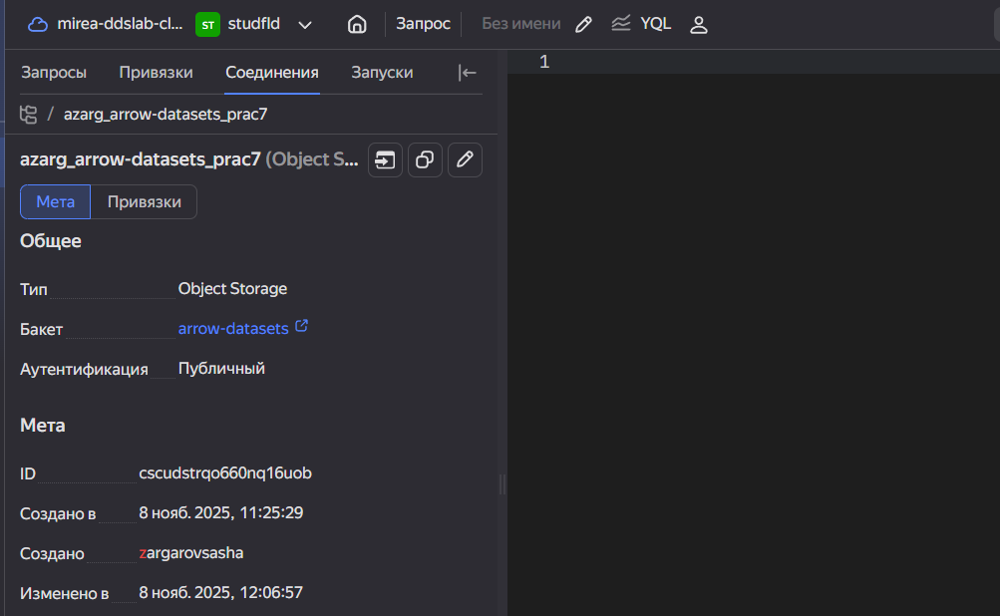
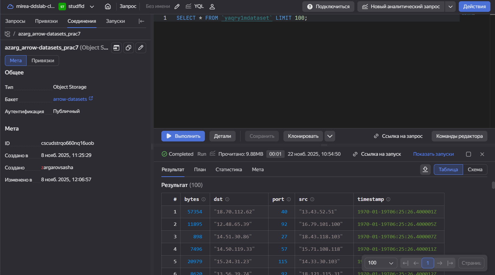
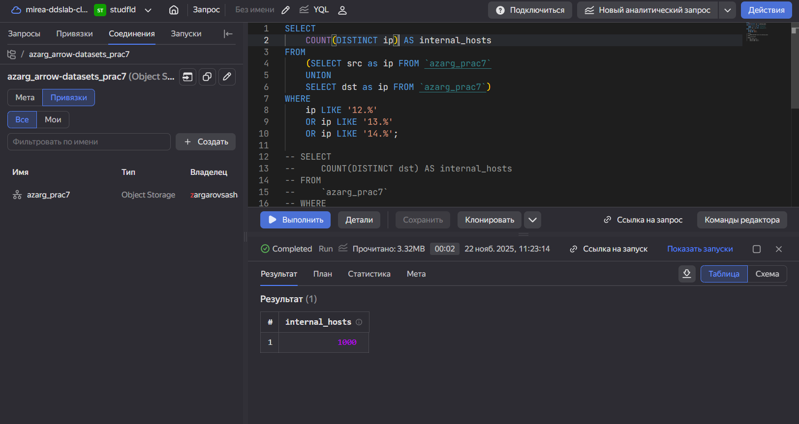
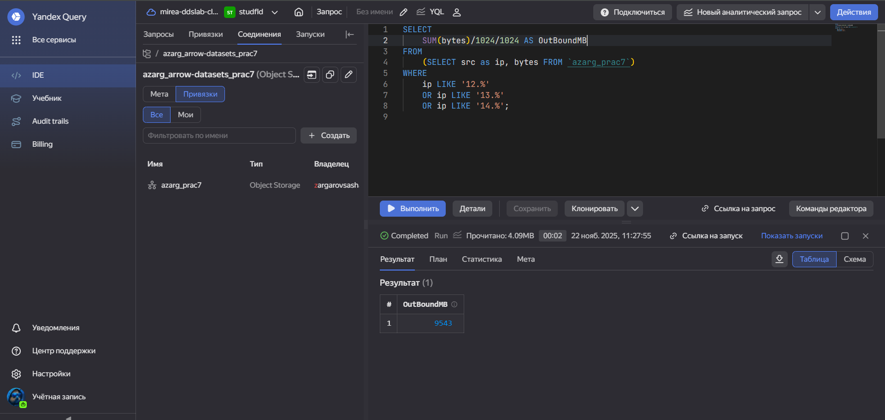
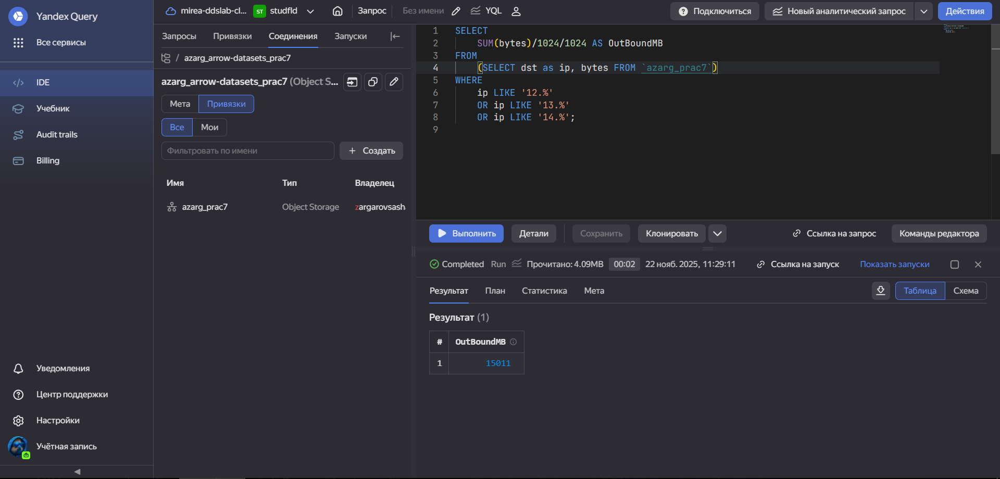

# Использование технологии Yandex Query для анализа данных сетевой
активности
QazRT

## Цель работы

## Исходные данные

1.  Программное обеспечение Windows 10 Pro
2.  Visual Studio Code с установленными плагинами для работы с языком R
3.  Интерпретатор языка R 4.5.1

## План

1.  

## Шаги:

1.  Создание соединения:

    

2.  Выполнение тестового запроса:

    

3.  Количество IP-адресов внутренней подсети

    

4.  Суммарный объем исходящего трафика:

    

5.  Суммарный объем входящего трафика:

    

## Оценка результата

В результате лабораторной работы мы научились работать с Yandex Query
Language

## Вывод

Таким образом, мы научились взаимодействовать с жкосистемой Yandex Cloud
и их продуктами Yandex Query и S3
